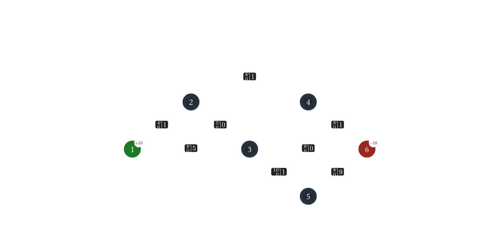

# cost-scaling-rs

A Rust implementation of the **CS2** minimum-cost maximum-flow algorithm, based on the cost-scaling successive approximation method by Andrew V. Goldberg.

CS2 solves the [minimum-cost flow problem](https://en.wikipedia.org/wiki/Minimum-cost_flow_problem): given a directed network with arc capacities and per-unit flow costs, find the cheapest way to route a specified amount of flow from sources to sinks.


## Usage

### Input format

The solver accepts the standard [DIMACS minimum-cost flow format](http://lpsolve.sourceforge.net/5.5/DIMACS_mcf.htm):

```
c comment lines
p min <nodes> <arcs>
n <node_id> <supply>
a <tail> <head> <lower_bound> <upper_bound> <cost>
```

### Example

`testdata/sample.inp` describes[^1] a 6-node, 8-arc network: node 1 supplies 10 units, node 6 demands 10. Each edge label shows the capacity bounds (upper, lower) and the per-unit cost.

```dimacs
p min 6 8
c min-cost flow problem with 6 nodes and 8 arcs
n 1 10
c supply of 10 at node 1
n 6 -10
c demand of 10 at node 6
c arc list follows
c arc has <tail> <head> <capacity l.b.> <capacity u.b> <cost>
a 1 2 0 4  1
a 1 3 0 8  5
a 2 3 0 5  0
a 3 5 0 10 1
a 5 4 0 8  0
a 5 6 0 8  9
a 4 2 0 8  1
a 4 6 0 8  1
```

The solution output, from `cargo run -- testdata/sample.inp` is:

```
s 70
f       1       2          4
f       1       3          6
f       2       3          4
f       3       5         10
f       4       6          8
f       4       2          0
f       5       4          8
f       5       6          2
```

The figure below represents the problem and the solution by diagramming the graph:

<picture>
  <source media="(prefers-color-scheme: dark)" srcset="diagrams/sample-dark.png">
  <source media="(prefers-color-scheme: light)" srcset="diagrams/sample-light.png">
  
</picture>

### As a library

**From a DIMACS file:**

```rust
use cost_scaling_rs::McmfCs2;

let solver = McmfCs2::from_dimacs_file("problem.min")?;
let solution = solver.min_cost()?;
println!("Optimal cost: {}", solution.objective_cost);
```

**Programmatically:**

```rust
use cost_scaling_rs::McmfCs2;

let num_nodes = 6;
let num_arcs = 8;
let mut solver = McmfCs2::new(num_nodes, num_arcs); // 6 nodes, 8 arcs

// Set supply (+) and demand (-) BEFORE adding arcs.
solver.set_supply_demand_of_node(1, 10)?;  // source: +10
solver.set_supply_demand_of_node(6, -10)?; // sink: -10

// Add arcs: (tail, head, lower_bound, upper_bound, cost)
solver.set_arc(1, 2, 0, 4, 1)?;
solver.set_arc(1, 3, 0, 8, 5)?;
solver.set_arc(2, 3, 0, 5, 0)?;
solver.set_arc(3, 5, 0, 10, 1)?;
solver.set_arc(5, 4, 0, 8, 0)?;
solver.set_arc(5, 6, 0, 8, 9)?;
solver.set_arc(4, 2, 0, 8, 1)?;
solver.set_arc(4, 6, 0, 8, 1)?;
let solution = solver.min_cost()?;
println!("Optimal cost: {}", solution.objective_cost);

for (tail, head, flow) in solution.flows() {
    if flow > 0 {
        println!("  {} -> {}: {}", tail, head, flow);
    }
}
```

> **Note:** When building problems programmatically, call `set_supply_demand_of_node` **before** `set_arc`. This is required because `set_arc` adjusts node excess internally for arcs with nonzero lower bounds.

Node IDs are `1..=num_nodes`, including isolated nodes. Add exactly the declared
number of arcs; incomplete builders and excess insertions return errors. Repeated
supply setters replace the previous value, but setting supplies after adding arcs
is rejected. `min_cost` consumes the solver; the legacy `run_cs2` method cannot be
used to solve or rebuild the same instance again after preprocessing.

Costs, capacities, and supplies use `i64`. Internal cost scaling and price/excess
updates must also fit: unsupported arithmetic returns `PriceOverflow` or
`ExcessOverflow` in both debug and release builds. The returned objective is an
approximate `f64`, so integer objectives above `2^53` need not be exact. Enable
`check_solution(true)` to additionally verify feasibility and optimality; this
also supports nonzero lower bounds.

### As a CLI

```bash
cargo run --release -- problem.min
```

Outputs the solution in DIMACS format:
```
s <objective_cost>
f <tail> <head> <flow>
...
```

## Testing

The test suite validates the Rust implementation against the original C reference (included in `cs2/`):

```bash
cargo test
```

This runs:

- **Unit tests** for the DIMACS parser and GOTO problem generator
- **Integration tests** that compare Rust and C across 41 problems: static test files, procedurally generated GOTO networks of various sizes (15 to 1000 nodes), and hand-crafted edge cases (parallel arcs, lower bounds, cycles, bottlenecks, etc.). The zero-cost self-loop case allows different equally optimal loop flows.
- **Correctness regressions** for input validation, isolated nodes, overflow, lower bounds, builder lifecycle, self-loops, output, and heuristic boundaries. A separate brute-force oracle enumerates all flow assignments on 500 small graphs, checking both feasible and infeasible cases independently of C.

The C binary is compiled automatically on first test run.

The solver unit tests and graph regressions are also checked with Miri in CI:

```bash
cargo +nightly miri test --lib --test miri_soundness --test correctness_regressions
```

The subprocess-based output test runs natively and is skipped under Miri.

## Benchmarks

### Criterion (Rust-only)

Microbenchmarks using [Criterion.rs](https://github.com/bheisler/criterion.rs):

```bash
cargo bench
```

HTML reports are generated in `target/criterion/`. Subsequent runs report relative performance changes.

### Comparative (Rust vs C)

End-to-end timing comparison against the reference C implementation using [hyperfine](https://github.com/sharkdp/hyperfine):

```bash
cargo run --release --example bench_compare
```

This builds both binaries with maximum optimization (`-O3`/LTO), generates GOTO problems at 500–10,000 nodes, and runs hyperfine on each. Extra arguments are forwarded to hyperfine:

```bash
cargo run --release --example bench_compare -- --warmup 5 --min-runs 50
```

**Dependencies:** `cargo`, `gcc`/`cc`, `make`, `hyperfine` (`brew install hyperfine` or `cargo install hyperfine`).

## Project structure

```
src/
  lib.rs      - McmfCs2 solver implementation
  parser.rs   - DIMACS .min format parser
  main.rs     - CLI entry point
  problem_generators/
    mod.rs    - Graph problem generator module
    goto/     - GOTO (Grid On Torus) test problem generator
    netgen/   - NETGEN assignment, transportation, and network flow generator
cs2/          - Reference C implementation (Goldberg, IG Systems)
testdata/     - Static DIMACS test inputs
tests/        - Integration tests (Rust vs. C comparison)
```

## References

- A.V. Goldberg, "An Efficient Implementation of a Scaling Minimum-Cost Flow Algorithm," *Journal of Algorithms*, 22(1), 1997.
- The original C implementation: [cs2](https://github.com/iveney/cs2)

## License

The `cs2/` directory contains the original C implementation, which is Copyright (C) 1995-2009 IG Systems, Inc. It is included for testing purposes only. See `cs2/COPYRIGHT` for terms.

[^1]: Diagrams are rendered from typst sources in [`diagrams/`](diagrams/) and regenerated by [`diagrams/gen_diagrams.sh`](diagrams/gen_diagrams.sh).
